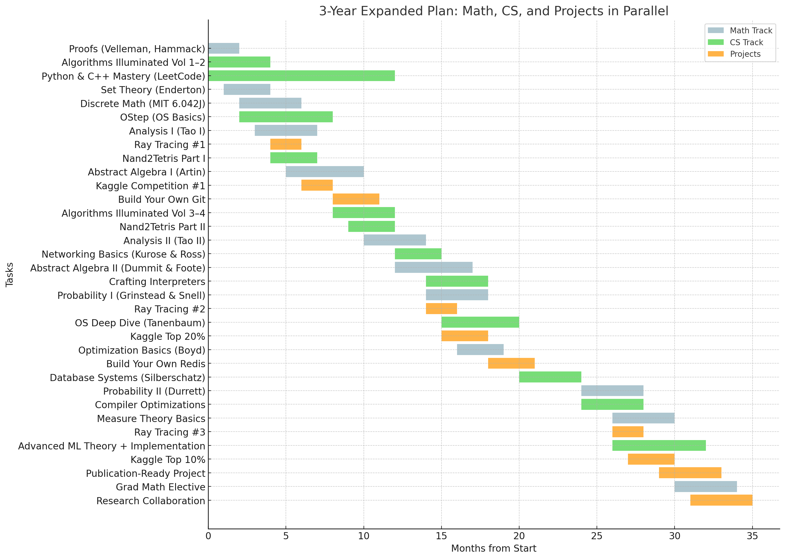

# My Learning/Growth Journal

Hi! I'm documenting my learning journey here.

The plan is quite ambitious: 

#### Doing two ambitious projects:
- [Ray tracing with gravity distortion and postprocessing](https://github.com/k-tro/raytracer)
- [Benchmarking VAEs and their variants across multiple datasets after learning how they work](https://github.com/k-tro/VAE_and_beyond)
#### trying not to be late for this:

#### while also doing four Coursera specializations:
- [IBM Data Science Fundamentals](https://www.coursera.org/specializations/data-science-fundamentals-python-sql)
- [Meta Full-Stack Developer](https://www.coursera.org/specializations/meta-full-stack-developer)
- [Applied Data Science with Python - Michigan](https://www.coursera.org/specializations/data-science-python)
- [MLOps - Duke](https://www.coursera.org/specializations/mlops-machine-learning-duke)

### 🔗 Weekly Logs:
You can follow my weekly progress here:

---

Built with [GitHub Pages](https://pages.github.com/).  
Licensed under [CC BY-NC 4.0](https://creativecommons.org/licenses/by-nc/4.0/).
